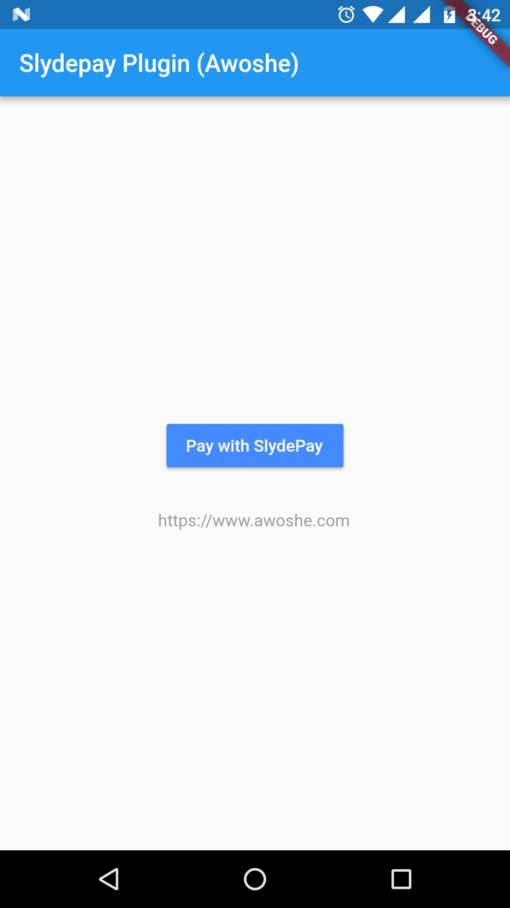

# :credit_card: Slydepay Plugin for Flutter

A flutter plugin to integrate the Slydepay plugin for iOS and Android. Currently only implemented for android. IOS plugin will be implemented as well. Pull requests are always welcome.

## Features

* [x] Android (iOS Coming Soon)

  * [x] Slydepay Payment
  * [x] VISA, MTN Mobile money, Vodafone payment
  * [x] All supported payment options with your account

* Supported formats

  * [Android](https://developer.android.com)

### Screenshots

 

### Show some :heart: and star the repo to support the project

* Please note this is a plugin only. This plugin has used the Android SDK

## Usage
To use this plugin :

* add the dependency to your [pubspec.yaml](https://github.com/gibbsvjy007/slydepay_payment) file.

```yaml
  dependencies:
    flutter:
      sdk: flutter
    slydepay_payment:
```

To call payment procedure:

```dart
import 'package:slydepay_payment/slydepay_payment.dart';

List<dynamic> result = await SlydepayPayment.openSlydepayPaymentDialog(
      amount: amount,
      itemName: itemName,
      description: desc,
      customerName: customerName,
      customerEmail: customerEmail,
      orderCode: orderCode,
      phoneNumber: phoneNumber,
      merchantKey: merchantKey,
      merchantEmail: merchantEmail
    );
    print("RESULT TYPE " + result[0]); // 1: SUCCESS, 2: FAILED, 3: CANCELLED
    print("MSG " + result[1]);
```


# Special Thanks
**[@norrisboateng](https://github.com/norrisboa) For his sdk [Slydepay-android-sdk-with-sample](https://github.com/norrisboat/SlydepayAndroidSDK)**

## TODO

- [ ] better error handling

## Created & Maintained By

[Vijay Rathod](https://github.com/gibbsvjy007)

> If you found this plugin helpful and want to thank me, consider buying me a cup of :coffee:
>
> * [PayPal](https://www.paypal.me/gibbsvjy007)

# License

    Copyright 2018 awoshe.com

    Licensed under the Apache License, Version 2.0 (the "License");
    you may not use this file except in compliance with the License.
    You may obtain a copy of the License at

       http://www.apache.org/licenses/LICENSE-2.0

    Unless required by applicable law or agreed to in writing, software
    distributed under the License is distributed on an "AS IS" BASIS,
    WITHOUT WARRANTIES OR CONDITIONS OF ANY KIND, either express or implied.
    See the License for the specific language governing permissions and
    limitations under the License.
